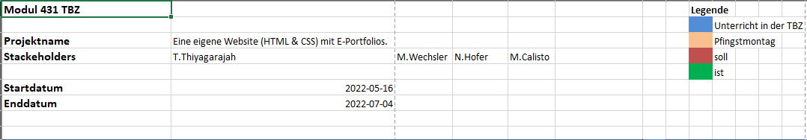
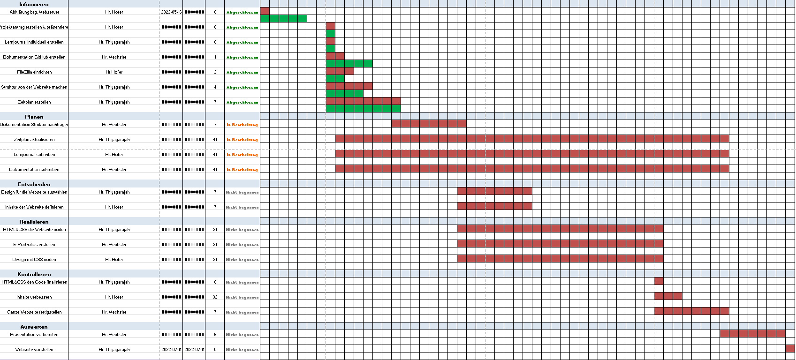
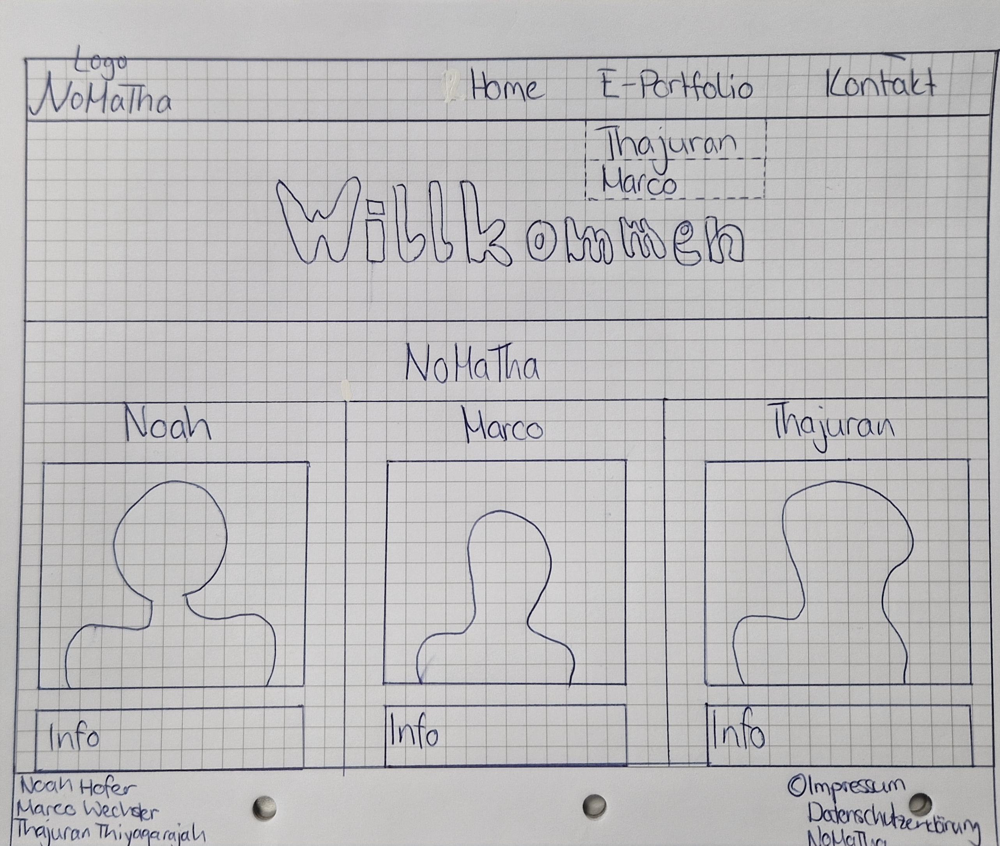

# Planen

## Meilensteinziele
Bei der Planung unseres Projektes ist uns klar geworden, dass wir nicht nur einfach ein Projekt machen wollen, sondern Ziele haben und diese verwirklichen möchten.  
Somit haben wir uns sieben Meilensteinziele gesetzt die wir natürlich auch mit aller Kraft und Ehrgeiz versuchen zu erreichen. 
Wir haben uns vorgenommen wenn wir diese nicht erreichen es zu Hause irgendwie nachzuhohlen, damit wir zum einten keinen Stress am Ende des Projekts haben und zum anderen, dass wir auch zufrieden mit uns und unserem Projekt sein werden.  
_Hier sieht man unsere sieben **Meilensteinziele** die wir uns gesetzt haben:_ 

1. Projektantrag abgeben und mit der Informationsbeschaffung beginnen.
2. Planung abschliessen und zugleich auch noch die Entscheidung treffen.
3. Anfangen die Website zu gestalten und zumindest die Startseite (index.html) im Browser aufrufen können.
4. Eigene E-Portfolios machen, jeder arbeitet individuell und kann somit seinen eigenen Gedanken nach gehen.
5. Weiter an den E-Portfolios arbeiten und diese fertigstellen.
6. Dokumentation überarbeitet und abgeschlossen, Lernenden Journals beenden.
7. Vorträge vorbereitet und bereit zu Präsentation und nochmals alles überfliegen und gefundene Fehler korrigiert.

---

## Zeitplan

Wir haben auch einen Zeitplan nach dem IPERKA-System erstellt.
Damit wir über das ganze Projekt den Überblick behalten können wie weit wir sind und wie lange wir noch Zeit für die eizelnen Schritte bzw. Aufträge haben. 
Mit dem Zeitplan haben wir jederzeit eine Übersicht was noch erledigt werden muss, falls wir mal sehen sollten das der Zeitplan nicht aufgeht können wir es mit Nacharbeiten oder einfach zu Hause kompensieren.  
_Hier sieht man noch unseren **Zeitplan**:_ 

---

## Webseite Aufbau

Für unsere Webseite brauchten wir eine Idee wie wir anfangen wollten. Was genau wir machen wollten hatten wir schon entschieden. 
Es sollte eine Startseite geben mit drei verlinkten E-Portfolios. Bei den E-Portfolios kann jeder selbst entscheiden was der Inhalt sein sollte und man kann seiner Kreativität freien Lauf lassen. 
Zuerst waren wir uns nicht einig gewesen, vor allem bei den E-Portfolios, aber wir haben uns hingesetzt und mit einigen Diskussionen zu einer gemeinsamen Lösung gefunden.  
Die Sartseite zu gestalten und zu Designen, weil wir etwas gemeindam ausgesucht und zugleich entschieden haben, dass wir alle zufrieden damint sind.
Deswegen haben wir von Anfang an eine Skizze gemacht, wie die Startseite genau aussehen sollte. 
_Hier sieht man die **Skizze**:_  

---
