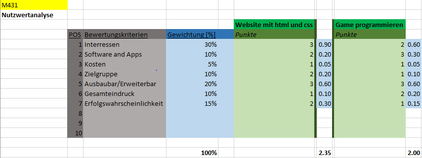

# Entscheiden

## Warum wollten wir zusammenarbeiten?
Wir wollten zusammen in einem Team sein, denn wir sind gut miteinander befreundet und können sehr gut zusammen arbeiten. 
Wir wissen, dass das die perfekten Voraussetzungen sind um zusammen in diesem Projekt zu arbeiten. 
Uns ist klar bewusst, dass zu dritt mehr Herausforderungen auf uns zukommen werden, aber diese genau deswegen sind wir in einer Gruppe. 
Jeder kennt den anderen und weiss wir können uns aufeinander verlassen, darum nehmen wir diese Herausforderung gerne an. 

---

## Wieso haben wir uns für die Webseite entschieden?
Noah und Thaju hatten den Plan, eine eigene Webseite zu erstellen, was aber genau der Inhalt sein sollte wussten Sie noch nicht. 
Marco war noch nicht ganz von diesem Projekt überzogen, also suchte er im Internet noch ein bischen nach Ideen.  
Thaju und Noah haben Marco nicht beeinflusst und Ihm unsere ehrliche Meinung dazu gesagt, wie cool wir es fänden, wenn er mit uns die Idee verwirklichen möchte. 
In der Zwischenzeitals Marco sich noch einige Gedanken zum Projekt machte, haben Thaju und Noah sich gedanken gemacht, wie Sie sich den Inhalt der Website vorstellen. 
Als sie dann zum Entschluss gekommen sind das jeder sein eigenes E-Portfolio erstellen kann und seinen Ideen freien Lauf lassen kann, war Marco auch davon überzeugt. 
Alle waren Happy, dass wir etwas gefunden haben und freuen uns auf die kommende Zeit in der wir es verwirklichen werden. 

---

## Was sollte der Inhalt der Webeite sein?
Beim Entscheiden des Inhaltes der Webseite war es für uns sehr leicht, denn wir hatten kaum verschiedene Vorstellungen der Startseite 
und bei den E-Portfolios kann sich jeder selbst über den Inhalt gedanken machen und entscheiden. 
Die Skizze für die Startseite haben wir zusammen realisiert, somit gab es schlussendlich nur eine Lösung und wir mussten uns nicht wirklich entscheiden.

---

## Nutzwertanalyse

Mit der Nutzwerkanalyse konnten wir von anfang an gut für ein Projekt entscheiden bzw. waren uns sicher was wir in dieser Zeit angehen.
