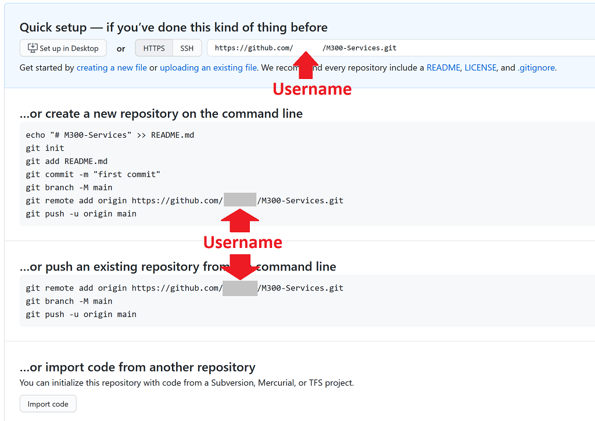
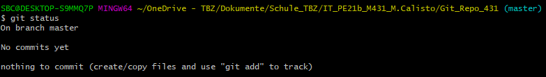
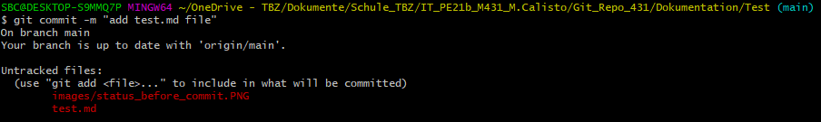
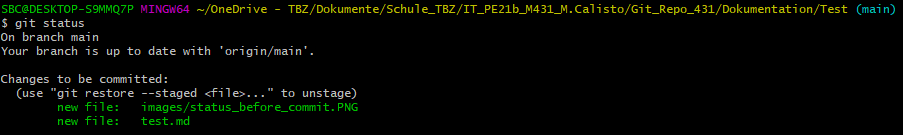
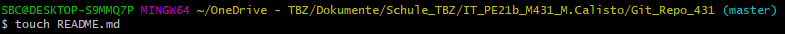
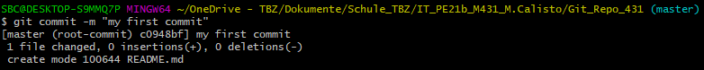
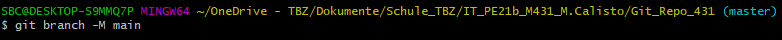
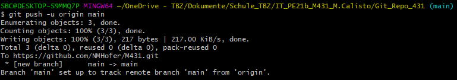

# Git Repository anlegen

### Starten mit einem neuen Git-Repository

Als erstes wird auf Github ein Repository erstellt. Danach bringen wir ein *vorhandenes, lokales Verzeichnis* unter **Git Versionskontrolle**, um diese beiden Repos anschliessend zu synchronisieren (verknüpfen). Ab dann können die lokalen Daten in das *remote Repository*  von [Github](https://github.com/) **"ge"pushed** - oder umgekehrt, die Daten von [Github](https://github.com/) in das lokale Repository **"ge"pulled** werden.

---

### Remote Git Repository erstellen  

Vorbereitend für das **M431** erstellen wir auf [Github](https://github.com/) ein neues, **leeres** Repository, mit welchem wir weiter unten das lokale Repo verknüpfen

#### Voraussetzungen

  - [Github](https://github.com/) Account  
  - Ein auf Github hinterlegter **SSH-PublicKey** des lokalen Benutzers/Rechner ist Voraussetzung  
  - Windows: [GitBash](https://git-scm.com/downloads) auf dem lokalen Host installiert  
  - Editor: z.B: [Visual Studio Code](https://code.visualstudio.com/) , [Atom](https://atom.io/) oder [Sublime Text](https://www.sublimetext.com/) etc...  
  - Den Willen etwas neues zu **lernen** und so viel **Spass** haben wie möglich!!! :)

Folgende Settings für das [Github](https://github.com/)-Repo sind vorgesehen

> `Repository name:  ` _M431_ 
> `Description:  ` _Aufträge im eigenen Berufsumfeld selbstständig durchführen_  
> `Private:  ` _Repo auf "Private" setzen und später LP (weitere Contributors) einladen_ 
> `Initialize this repository with:  ` _NICHTS ankreuzen - erfolgt zu einem späteren Zeitpunkt_  

---

### Git Repository lokal anlegen/initialisieren

Zu beginn sollte man sich einen Pfad bzw. geeigneten Ort aussuchen wo man sein .git Verzeichnis haben möchte.  
Wenn man das hat geht man dort in das Verzeichnis rein -> Rechtsklick und auf **Git Bash Here** und dann ist man start klar.

Zuerst wird das Git Repo initialisiert, damit wir überhaupt irgenetwas mit Git anfangen können.

Hier habe ich noch verschiedene Vorgehensweisen wie man ein Repository erstellen kann:
  

Wir hatten noch kein existierendes Repository, somit haben wir eins von der Kommandozeile aus erstellt.
- **Tipp**: Lernt auf der Kommandozeile zu arbiten, vor allem bei Git, es wird euch vieles erleichtern.

Jetzt werde ich euch einige Befehle zeigen, wie wir unser Repository eingerichtet und Schritt für Schritt erklären was genau gemacht wurde.

#### Commands die wir verwenden müssen (lokal auf der Gitbash)

> `$ cd <Projektverzeichnis> ` _irgend ein Verzeichnis, welches **nicht** unter Git Kontrolle ist_ 
> `$ mkdir M431_Repository  ` _künftiges Repository-Verzeichnis erstellen_  
> `$ cd M431_Repository  ` _Ins Repository-Verzeichnis wechseln_  
> `$ git init  ` _Lokales Git-Repo initialisieren (erstellt .git-Verzeichnis)_  
> `$ ls -lisa ` _nach dem *init* Befehl existiert neu das .git Verzeichnis, welches u.a. das locale Repository enthält_

#### Erster Commit im lokalen Repository (lokal auf der Gitbash)
Mit den folgenden Kommandos wird ein erstes File (in unserem Fall das README.md) im getrackten Verzeichnis erstellt, ge"stage"d und commited. Mit dem "Commit" wird der aktuelle Stand in mein lokales Repository eingepflegt. 

> `$ echo "# M431 Dokumentation " >> README.md  ` _File "README.md" mit Titel erstellen_  
> `$ git add .   ` _Added alle Files im aktuellen Verzeichnis zur "Staging area"_  
> `$ git add README.md` _Added nur die Files, die man angibt, in diesem Fall das README.md_  
> `$ git commit -m "First Commit"` _Files werden ab jetzt lokal getracked_  
> `$ git log` _Log Eintrag des eben ausgeführten Commits zeigen_  

#### Synchronisation des lokalen Repos mit dem Github-Repository (Origin)
...jetzt muss das lokale Repository mit dem Remote-Repository gesynched werden, damit das kollaborative Arbeiten daran ermöglicht werden kann. Im nächsten Schritt wird das lokale Repository mit dem Github-Repository einmalig "verlinkt". Danach kann das Repository jeweils **ge"pushed"**, **ge"pulled"**, **ge"klont"**, **ge"forked"** oder **ge"branched"** werden.  

Dies geschieht mit folgenden Kommandos:

> `$ git remote add origin https://github.com/<Benutzername>/M431.git   ` _Verlinken der Repos_  
> `$ git branch -M main   `_Ändert den branch von Master zu main_  
> `$ git push -u origin master   ` _Github-Passwort eingeben und hochladen_  

---

Alle Kommandos, wie sie in der richtigen Reihenfolge eingegeben werden:

`$ cd <Projektordner>`  
`$ git init`  
  
`$ git status`  
  
`$ git status` _Wenn nach dem commit etwas verändert, hinzugefügt oder gelöscht wurde_  
  
`$ git status` _Sobald alle Files wieder in der Staging Area sind_  
  
`$ touch README.md`  
  
`$ git add README.md`  
  
`$ git commit -m "first commit"`  
  
`$ git branch -M main`  
  
`$ git remote add origin https://github.com/<Benutzername>/M431.git`  
  
`$ git push -u origin main`  
  

---

#### Summary

- Zuerst wurde das Git-Repo "M431" lokal und remote erstellt und verlinkt (Daten werden ab diesem Zeitpunkt ge"**tracked**" und können ge"**pushed**" oder ge"**pulled**" werden). 
- Im lokalen Git-Repository wurde das File "README.md" erstellt und commited. Daten im Verzeichnis werden nun also **lokal** verwaltet und getrackt.
- Abschliessend wurde mit dem "git push"-Kommando der aktuelle lokale Repo-Inhalt zum **"Origin"** (Github-Repo, Remote) übertragen.  

**Ab diesem Zeitpunkt sind wir bereit, um das Repository aktiv zu bewirtschaften - **IaC** (Infrastructure as Code) ready.**

---
