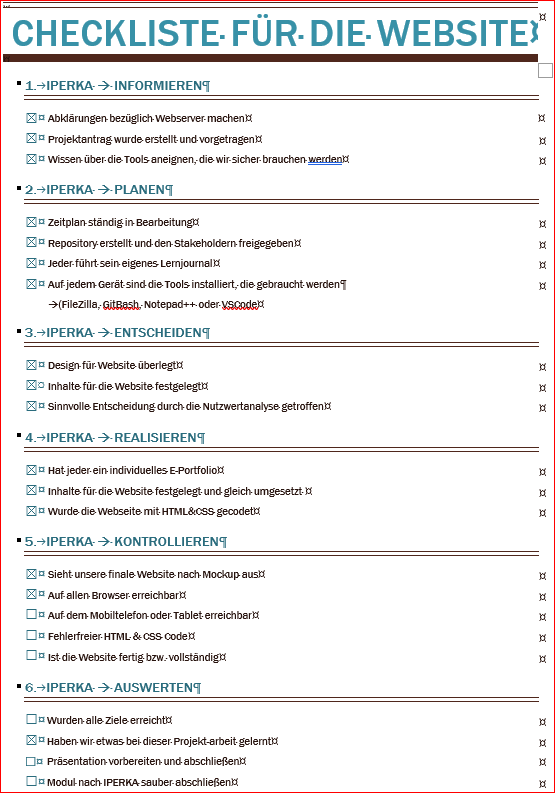

# Kontrollieren
Beim Kontrollieren haben wir eine Checkliste erstellt und sind jeden einzelnen Punkt durchgegangen. Wir sind hier auch mit IPERKA vorgegangen.
**Hier sieht man unsere Checkliste:** 

