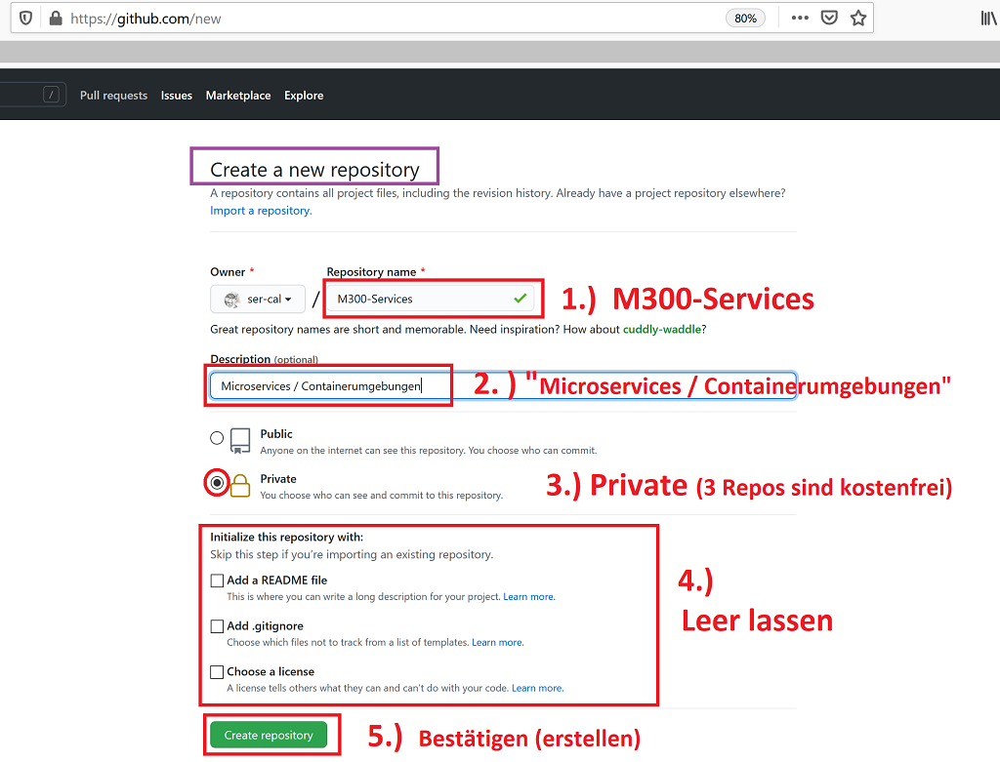

# Git Repository anlegen

### Starten mit einem neuen Git-Repository 

Als erstes wird auf Github ein Repository erstellt. Danach bringen wir ein *vorhandenes, lokales Verzeichnis* unter **Git Versionskontrolle**, um diese beiden Repos anschliessend zu synchronisieren (verknüpfen). Ab dann können die lokalen Daten in das *remote Repository*  von [Github][10] **"ge"pushed** - oder umgekehrt, die Daten von [a link](https://github.com/) in das lokale Repository **"ge"pulled** werden.

### Remote Git Repository erstellen

Vorbereitend für das **M431** erstellen wir auf [Github][10] ein neues, **leeres** Repository, mit welchem wir weiter unten dann das lokale Repository verknüpfen

> Ein auf Github hinterlegter **SSH-PublicKey** des lokalen Benutzers/Rechner ist Voraussetzung  

Folgende Settings für das [Github][10]-Repo sind vorgesehen (_Screenshot unten dient als Beispiel_):

> `Repository name:  ` _M431_ 
> `Description  ` _Aufträge im eigenen Berufsumfeld selbstständig durchführen_  
> `Private:  ` _Repo auf "Private" setzen und später LP (weitere Contributors) einladen_ 
> `Initialize this repository with:  ` _NICHTS ankreuzen - erfolgt zu einem späteren Zeitpunkt_  

